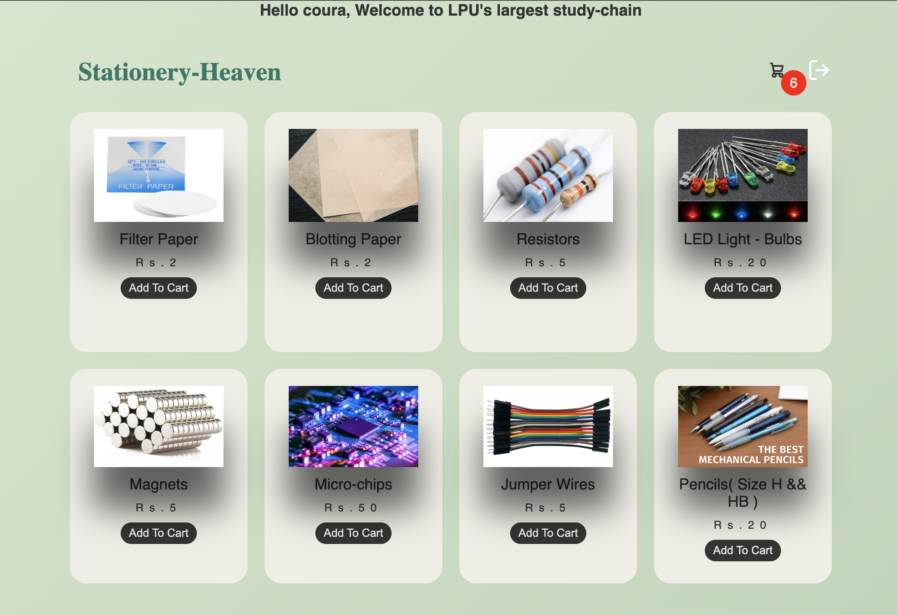

# ✨ Stationary Heaven

Stationary Heaven is a basic e-commerce web application built for selling stationery items. It supports user login/signup and allows users to add items to their cart and proceed to checkout.

### 🔐 Hero Page

---
---

## 🛠️ Tech Stack

- **Backend**: Node.js, Express.js
- **Database**: MongoDB (using `mongoose`)
- **Templating Engine**: Handlebars (HBS)
- **Frontend**: HTML, CSS, JavaScript

---

## Features
### User Authentication & Account Management
- Secure user signup and login using Node.js and MongoDB
- Guest login for quick and seamless purchasing
- Forgot password functionality for easy password reset
- Redirection to the home page after successful authentication
- Success email notifications on signup and order purchase using Nodemailer

### Shopping & Cart Functionality
- Browse and view stationery items
- Add items to cart with a fully functional cart system
- Checkout flow to complete purchases smoothly

### Front-End & UI
- Clean and minimal UI built with HTML, CSS, and JavaScript
- Handlebars (HBS) templating for dynamic and reusable UI components
- Static pages for future product showcases

### Backend & Integrations
- Node.js and Express backend with structured and modular architecture
- MongoDB for storing users, items, cart, and orders
- Nodemailer integration for transactional email services

### Additional Highlights
- Maintainable and extendable codebase
- Ready for deployment on platforms like Render or Vercel

### 🚀 Live Demo
- 🔵 Deployment (Render): [stationery-heaven-v2.onrender.com](https://stationery-heaven-v2.onrender.com)
- Thanks to - https://youtu.be/gXWohFYrI0M?si=vo1QXOQxSJe0dZ7B 

---