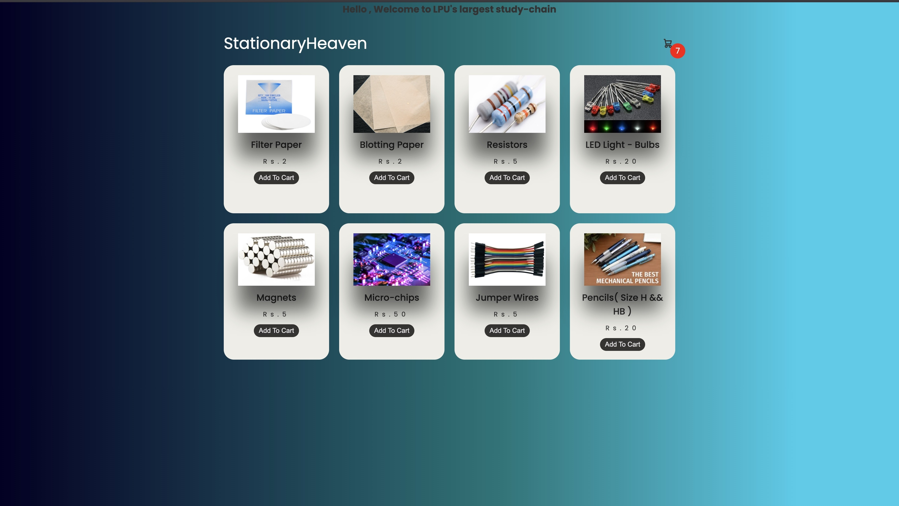

# ✨ Stationary Heaven

Stationary Heaven is a basic e-commerce web application built for selling stationery items. It supports user login/signup and allows users to add items to their cart and proceed to checkout.

### 🔐 Hero Page

---
---

## 🚀 Features

- User **signup** and **login** using MongoDB and Node.js
- On successful login/signup, user is redirected to the home (index) page
- Users can:
  - View and add stationery items to their cart
  - Checkout items from the cart
- Clean and minimal front-end built with **HTML**, **CSS**, and **JavaScript**
- Uses **Handlebars (HBS)** for templating

---

## 🛠️ Tech Stack

- **Backend**: Node.js, Express.js
- **Database**: MongoDB (using `mongoose`)
- **Templating Engine**: Handlebars (HBS)
- **Frontend**: HTML, CSS, JavaScript

---

### 🚀 Live Demo

- 🔵 Deployment (Render): [stationaryheaven-final.onrender.com](https://stationaryheaven-final.onrender.com)

Credits - https://youtu.be/gXWohFYrI0M?si=vo1QXOQxSJe0dZ7B 
